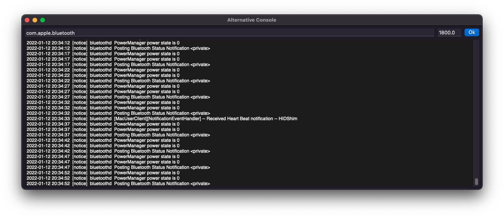

# alternative-console

An application developed with focus on learning XPC Services.

It contains the OSLogAlternativeConsoleService, responsible for accessing the local OSLogStore and retreive logs filtered by a subsystem and time, displaying they in a simple UI.

